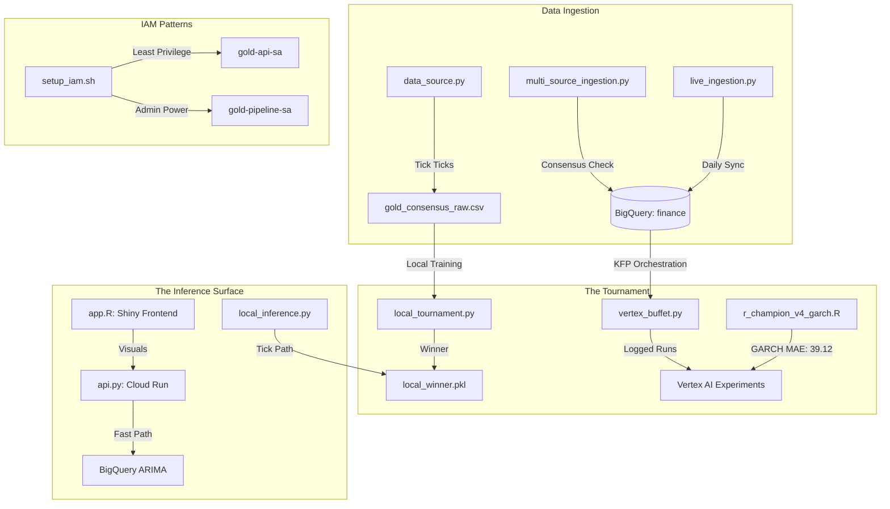

# 🏦 REPOGROK: Fintex Gold Price Forecasting
**Project ID**: finance-502004 | **Region**: us-central1
**Repository**: https://github.com/myrobot2020/fintex
**Last Audit**: 2026-07-25

## 🏗️ System Architecture (Mermaid)

## 📂 File Registry & Roles
| File Path | Component | Description |
| :--- | :--- | :--- |
| `main.tf` | **Infrastructure** | Root Terraform. Manages VPC, DB, and Security modules. |
| `app.R` | **Frontend** | Shiny Dashboard UI. |
| `finance/vertex_buffet.py` | **Orchestrator** | Master control for KFP Pipelines & Resource Audits. |
| `finance/incremental_ingestion.py` | **Data** | BigQuery MERGE logic for duplicate-free ingestion. |
| `finance/multi_source_ingestion.py` | **Safety** | Multi-source consensus (Gold vs GLD) pre-flight check. |
| `finance/api.py` | **Serving** | FastAPI logic for Cloud Run. Uses ARIMA baseline. |
| `finance/r_champion_v4_garch.R` | **Model (Champ)** | GARCH volatility model. Record MAE: 39.12. |
| `finance/tick_predictor.py` | **Model (Local)** | XGBoost Next-Tick Scalper (1m granularity). |
| `finance/gcp/iam/setup_iam.sh` | **Security** | Implements the dual Service Account IAM pattern. |

## 🛠️ Live Cloud Resources
*   **AutoML Model**: `7996651861547417600` (Champion in Registry).
*   **BigQuery Model**: `finance.gold_arima_baseline` (Challenger in BQ).
*   **Vertex Endpoint**: `8004731072988315648` (Empty/Cold).
*   **Cloud Run URL**: https://gold-forecast-api-jayxrndnrq-uc.a.run.app

## 💰 Cost-Safety Verification
*   **Cloud Run**: `min-instances: 0` (Pay-per-request).
*   **Vertex Endpoints**: 0 Deployed Models.
*   **Feature Store**: Online Serving = **OFF**.
*   **Total Idle Burn**: **$0.00 / hour**.

## 🏆 Tournament Leaderboard
1. **R-GARCH v4**: 39.12 MAE
2. **Ensemble v2**: 45.12 MAE
3. **XGBoost Local**: 46.79 MAE
4. **AutoML**: 0.58 R-Squared (Legacy)

---
**END OF REPOGROK**
